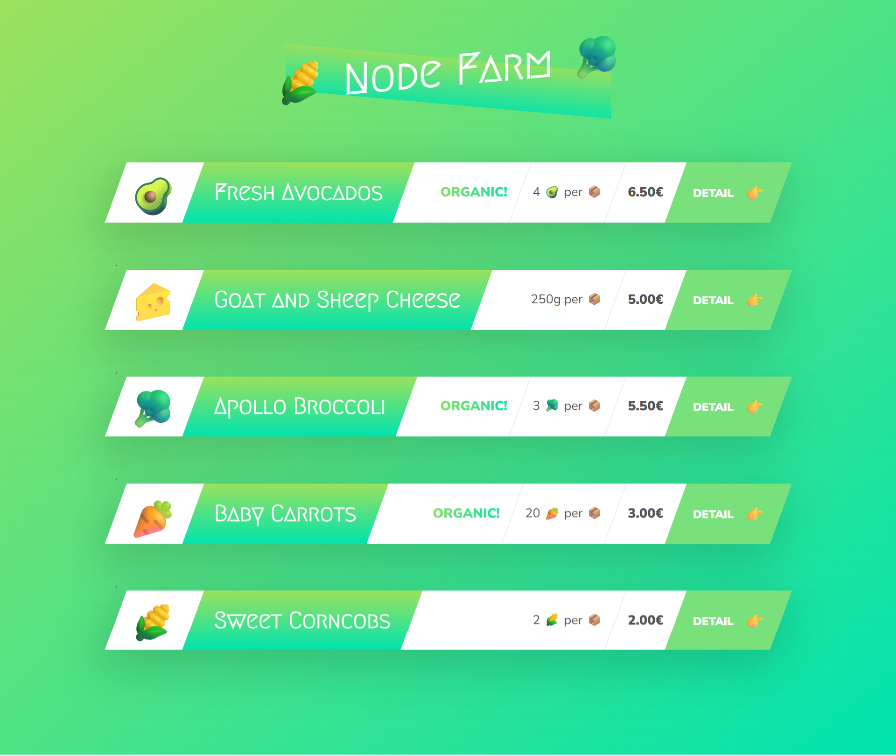
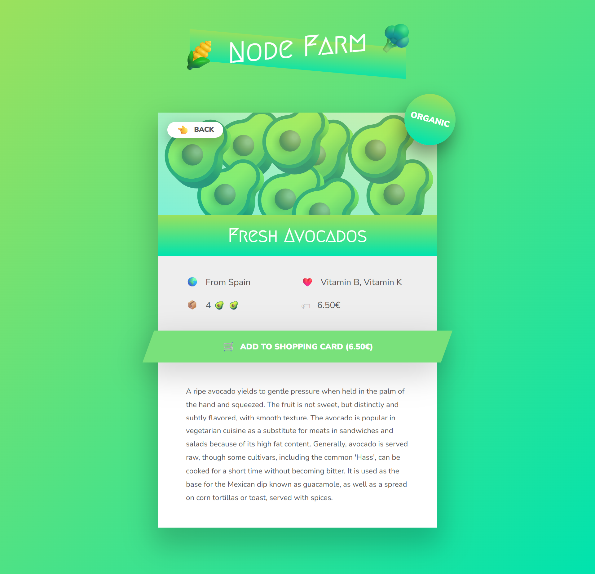

# Node Farm

A Node.js server application that displays farm products with dynamic templating.

## Project Structure

```
01-node-farm/
├── data/
│   └── products.json          # Product data
├── templates/
│   ├── overview.html          # Main products listing page
│   ├── product.html           # Individual product detail page
│   └── productCard.html       # Reusable product card component
├── utils/
│   └── templateReplace.js     # Template string replacement utility
├── server.js                  # Main server file
├── package.json               # Dependencies and scripts
├── Readme.md                  # This file
├── Overview.png               # UI reference screenshot
└── productDetails.png         # Product details UI screenshot
```

## Features

- Dynamic product listing from JSON data
- Individual product detail pages
- Template-based rendering system
- Responsive product card components

## UI Overview

### Products Listing



### Product Details



## Usage

```bash
npm start
# or
npm run dev
```

## Technologies

- Node.js
- Template string manipulation
- JSON data storage
